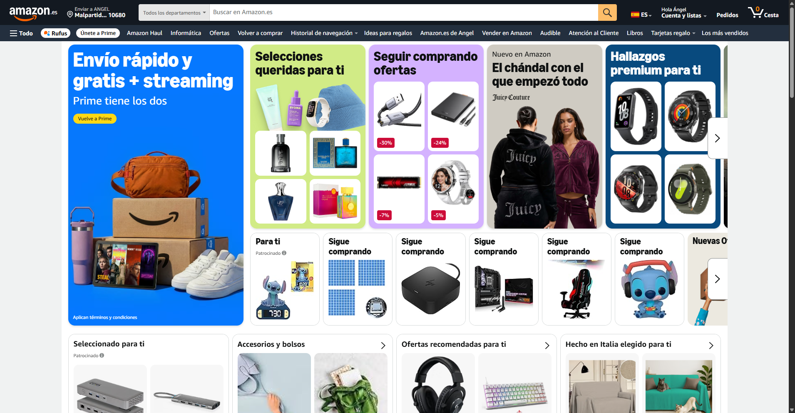
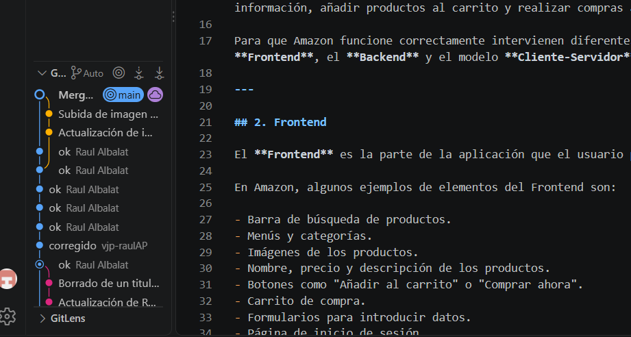
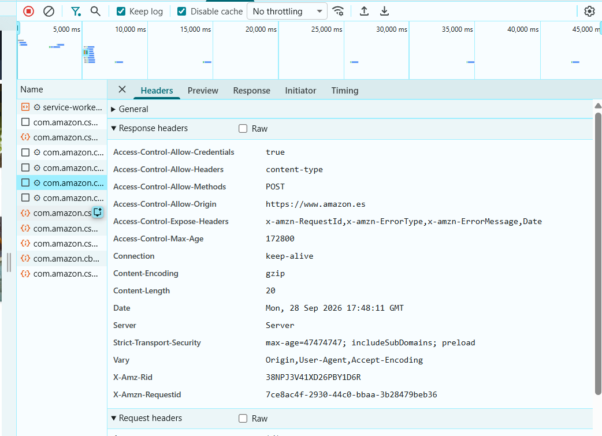
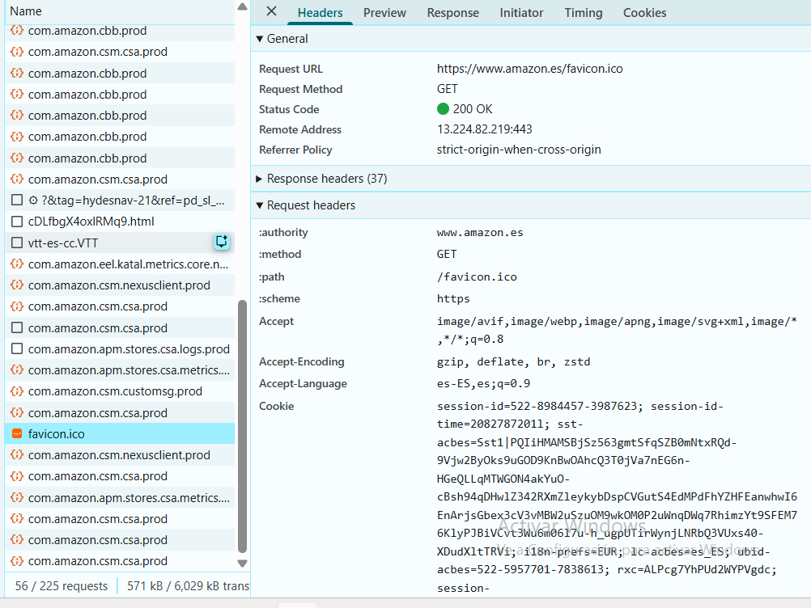

# Proyecto_Bloque1_DWEC



# Análisis de Amazon: Frontend, Backend y modelo Cliente-Servidor


## Commit de Angel y Raúl



## 1. Introducción

Amazon es una plataforma de comercio electrónico que permite a los usuarios buscar productos, consultar información, añadir productos al carrito y realizar compras a través de Internet.

Para que Amazon funcione correctamente intervienen diferentes tecnologías y componentes, principalmente el **Frontend**, el **Backend** y el modelo **Cliente-Servidor**.

---

## 2. Frontend

El **Frontend** es la parte de la aplicación que el usuario puede ver y utilizar directamente desde el navegador.

En Amazon, algunos ejemplos de elementos del Frontend son:

- Barra de búsqueda de productos.
- Menús y categorías.
- Imágenes de los productos.
- Nombre, precio y descripción de los productos.
- Botones como "Añadir al carrito" o "Comprar ahora".
- Carrito de compra.
- Formularios para introducir datos.
- Página de inicio de sesión.
- Diseño, colores, botones y otros elementos visuales.

El Frontend se ejecuta principalmente en el navegador del usuario y utiliza tecnologías como:

- **HTML**: estructura de la página.
- **CSS**: diseño y apariencia.
- **JavaScript**: comportamiento e interacción de la página.

Por ejemplo, cuando un usuario pulsa el botón **"Añadir al carrito"**, el Frontend se encarga de detectar la acción y comunicarse con el Backend para actualizar el carrito.

---

## 3. Backend

El **Backend** es la parte de Amazon que funciona en los servidores y que normalmente no podemos ver directamente.

Se encarga de procesar las peticiones realizadas por los usuarios y gestionar la información necesaria para que la aplicación funcione.

Algunas funciones del Backend de Amazon son:

- Gestionar las cuentas de los usuarios.
- Consultar los productos disponibles.
- Gestionar los precios y el stock.
- Procesar los carritos de compra.
- Gestionar los pedidos.
- Procesar los pagos.
- Guardar y consultar información en bases de datos.
- Gestionar los sistemas de autenticación.
- Enviar la información solicitada al usuario.

Por ejemplo, cuando buscamos un producto, el Backend recibe la búsqueda, consulta la información correspondiente y devuelve los resultados al navegador.

---

## 4. Modelo Cliente-Servidor

Amazon utiliza un modelo basado en **Cliente-Servidor**.

En este modelo existen principalmente dos partes:

- **Cliente**: normalmente es el navegador web del usuario.
- **Servidor**: son los sistemas informáticos que procesan las peticiones y proporcionan la información.

El funcionamiento básico sería el siguiente:

1. El usuario abre Amazon desde su navegador.
2. El navegador actúa como **cliente** y realiza una petición al servidor.
3. El servidor recibe la petición.
4. El Backend procesa la petición y consulta los datos necesarios.
5. El servidor devuelve una respuesta al cliente.
6. El navegador recibe la información y la muestra al usuario.
---

## 5. Captura DevTools 





## Resumen de DevTools

En la imagen podemos observar la pestaña **Network** de los DevTools del navegador. Esta herramienta permite ver las peticiones que realiza el navegador a los servidores de Amazon.

Al seleccionar una petición, en **Headers** podemos consultar información sobre la comunicación entre el cliente y el servidor.

En **Response Headers** aparecen datos enviados por el servidor, como:

- `Access-Control-Allow-Origin`: indica el origen permitido.
- `Access-Control-Allow-Methods`: indica los métodos HTTP permitidos.
- `Content-Encoding`: indica que la respuesta utiliza compresión `gzip`.
- `Content-Length`: indica el tamaño de la respuesta.
- `Connection`: muestra que la conexión utiliza `keep-alive`.
- `Server`: información sobre el servidor.
- `Strict-Transport-Security`: relacionado con la seguridad mediante HTTPS.
- `X-Amz-RequestId`: identificador de la petición de Amazon.

También aparece **Request Headers**, que contiene información enviada por el navegador al servidor.

En resumen, los DevTools permiten observar cómo el **cliente (navegador)** y el **servidor de Amazon** intercambian información mediante peticiones y respuestas HTTP.




# Resumen del DevTools

La imagen muestra **Chrome DevTools → Network (Red)**, utilizado para inspeccionar las peticiones que realiza una página web.

## Panel izquierdo — Solicitudes

- Se muestran aproximadamente **225 peticiones**.
- Aparecen recursos como:
  - `favicon.ico`
  - archivos `.html`
  - archivos `.VTT`
  - servicios internos de Amazon (`com.amazon...`)
- La petición seleccionada es **`favicon.ico`**.

## Panel derecho — Headers

### General

- **Request URL:** `https://www.amazon.es/favicon.ico`
- **Request Method:** `GET`
- **Status Code:** `200 OK`
- **Remote Address:** `13.224.82.219:443`
- **Referrer Policy:** `strict-origin-when-cross-origin`

### Request Headers

- `:authority` → `www.amazon.es`
- `:method` → `GET`
- `:path` → `/favicon.ico`
- `:scheme` → `https`
- `Accept` → formatos de contenido aceptados.
- `Accept-Encoding` → compresiones aceptadas (`gzip`, `deflate`, `br`, `zstd`).
- `Accept-Language` → idiomas preferidos (`es-ES`, etc.).
- `Cookie` → información de sesión/estado enviada al servidor.

## Pestañas superiores

| Pestaña | Función |
|---|---|
| **Headers** | Muestra las cabeceras de la petición y respuesta |
| **Preview** | Permite visualizar una vista previa de la respuesta |
| **Response** | Muestra el contenido recibido del servidor |
| **Initiator** | Indica qué acción o código originó la petición |
| **Timing** | Muestra cuánto tardó cada fase de la petición |
| **Cookies** | Muestra las cookies relacionadas con la petición |

## En resumen

El **Network de DevTools** permite ver cómo el navegador se comunica con un servidor.

En este caso:

`Navegador → GET /favicon.ico → Amazon → 200 OK`

Es decir, el navegador solicitó el favicon de Amazon y el servidor respondió correctamente.

### Ejemplo: búsqueda de un producto

Si un usuario busca "ordenador portátil" en Amazon:

```text
USUARIO
   |
   v
NAVEGADOR WEB
   |
   | Petición: "ordenador portátil"
   v
SERVIDOR DE AMAZON
   |
   v
BACKEND
   |
   v
BASE DE DATOS
   |
   | Resultados
   v
BACKEND
   |
   | Respuesta
   v
NAVEGADOR WEB
   |
   v
USUARIO


